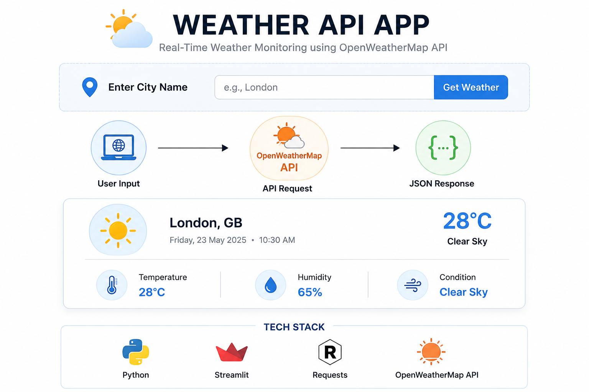

# weather-api-app

A simple weather forecasting application built using Python, Streamlit, and the OpenWeatherMap API. The project demonstrates API integration, JSON response handling, and real-time weather retrieval using both command-line and web-based interfaces.


<h1 align="center">Weather API Application</h1>

<h3 align="center">
Real-Time Weather Monitoring using OpenWeatherMap API
</h3>

<p align="center">
  
  
  
</p>

---

## Overview

This project retrieves real-time weather information using the OpenWeatherMap API and displays weather statistics including temperature, humidity, and weather conditions.

The project includes:

* Command-Line Weather Application
* Streamlit Web Dashboard
* OpenWeatherMap API Integration
* JSON Data Processing
* Real-Time Weather Retrieval

---

## Workflow

Input City Name

↓

API Request

↓

OpenWeatherMap Server

↓

JSON Response

↓

Data Extraction

↓

Weather Visualization

---

## Features

* Real-Time Weather Updates
* Streamlit-Based Web Interface
* Command-Line Version
* API Integration
* JSON Parsing
* Temperature Monitoring
* Humidity Monitoring
* Weather Condition Display

---

## Project Structure

```bash
weather-api-app/
│
├── assets/
│   ├── interface.png
│   └── workflow.png
│
├── src/
│   ├── weatherapp.py
│   └── deploy.py
│
├── requirements.txt
├── setup.py
├── .gitignore
├── LICENSE
└── README.md
```

---

## Installation

```bash
git clone https://github.com/your-username/weather-api-app.git

cd weather-api-app

pip install -r requirements.txt
```
---

<p align="center">
  
</p>

---

## Run Streamlit App

```bash
streamlit run src/weatherapp.py
```

---

## Run CLI Application

```bash
python src/deploy.py
```

---

## Technologies Used

* Python
* Streamlit
* Requests
* REST APIs
* JSON Processing

---

## Future Improvements

* Weather Forecasting (7-Day)
* Weather Icons
* Wind Speed Analysis
* Multiple City Comparison
* Geolocation Support
* Interactive Charts

---
